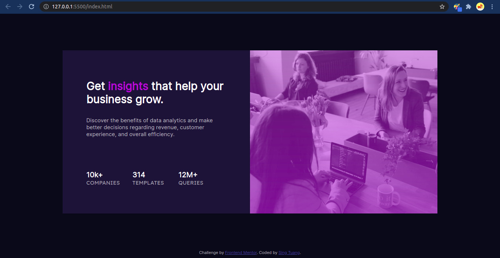

# Frontend Mentor - Stats preview card component solution

This is a solution to the [Stats preview card component challenge on Frontend Mentor](https://www.frontendmentor.io/challenges/stats-preview-card-component-8JqbgoU62). Frontend Mentor challenges help you improve your coding skills by building realistic projects. 

## Table of contents

- [Overview](#overview)
  - [The challenge](#the-challenge)
  - [Screenshot](#screenshot)
  - [Links](#links)
  - [Built with](#built-with)
  - [What I learned](#what-i-learned)
  - [Continued development](#continued-development)
  - [Useful resources](#useful-resources)
- [Author](#author)

## Overview

### The challenge

Users should be able to:

- View the optimal layout depending on their device's screen size

### Screenshot

### Links

- Solution URL: [https://github.com/Tuangpi/frondend-practice]
- Live Site URL: [https://tuangpi.github.io/frondend-practice])

## My process

### Built with

- Semantic HTML5 markup
- CSS custom properties
- Flexbox
- CSS Grid

### What I learned

### Continued development

### Useful resources

- [(https://www.google.com)] - This helped me for font-family. I really liked this and will use it going forward.
- [(https://www.w3school.com)] - This is an amazing article which helped me finally understand XYZ. I'd recommend it to anyone still learning this concept.

## Author

- Facebook - [Tuangpi](https://www.facebook.com/singkhantuang)
- Frontend Mentor - [@Tuangpi](https://www.frontendmentor.io/profile/Tuangpi)
